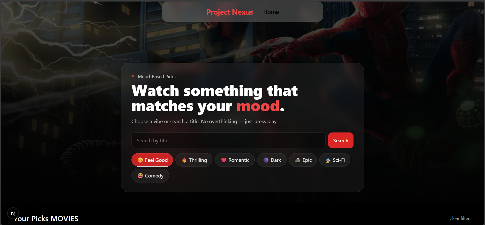
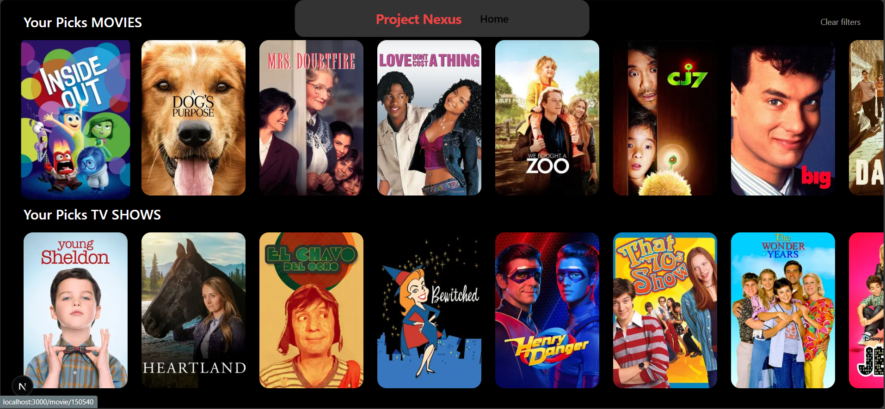

# 🎬 Project Nexus – ProDev Frontend Engineering Capstone

**Project Nexus** is the final milestone in the **ProDev Frontend Engineering** program.  
It is a real-world, production-grade movie recommendation web app built with **Next.js, TypeScript, TailwindCSS**, and the **TMDB API**.  
This capstone showcases the ability to design, build, and deliver a complete, responsive, and visually polished application.


---Project Nexus is a server-rendered, responsive movie recommendation application built with Next.js 14 (App Router), TypeScript, and TailwindCSS, integrating the TMDB API for real-time content retrieval. It implements mood-based recommendation logic, dynamic routing for individual movie pages, and optimized image delivery via Next.js <Image> with responsive sizing. The UI employs adaptive layouts and a glassmorphic navigation bar, with state and data handling fully encapsulated in modular fetch utilities. Designed for performance and scalability, the app leverages server-side data fetching for SEO benefits and reduced client payload, with an architecture ready for future PWA integration and extended filtering capabilities.

## 📖 Understanding Project Nexus

Project Nexus is where learners:
- Apply advanced frontend technologies to a **real-world project**.
- Build a **well-structured, responsive** application.
- Demonstrate **problem-solving skills** and **UI/UX design thinking**.
- Present and communicate their work effectively.

---

## 🎯 Objectives

1. **Apply Learned Skills** – Integrate HTML, CSS, JavaScript/TypeScript, React, and Next.js into a functioning application.
2. **Build Responsively** – Ensure a consistent and polished UI across all devices.
3. **Demonstrate Critical Thinking** – Solve technical and design challenges.
4. **Deliver Professionally** – Document, present, and deploy the application to industry standards.

---

## ✨ Key Features

- **Mood-Based Discovery** – Recommend movies based on the user’s mood.
- **Trending Movies** – Browse currently popular titles.
- **Movie Detail Pages** – Backdrop, poster, genres, rating, runtime, and overview.
- **Responsive Glassy Navbar** – Full width on mobile, half-width centered on desktop.
- **Optimized Image Loading** – Using Next.js `<Image>` for performance.
- **Dark Overlays for Readability** – Enhanced text legibility over images.
- *(Planned Enhancements)* Search, genre filtering, watchlist, and trailer playback.

---

## 🛠 Tech Stack

- **Framework**: [Next.js 14](https://nextjs.org/) (App Router)
- **Language**: TypeScript
- **Styling**: TailwindCSS
- **Data Source**: [TMDB API](https://developer.themoviedb.org/)
- **Deployment**: Vercel / Dokploy
- **Version Control**: Git + GitHub

---

## 📂 Folder Structure
src/
app/
page.tsx 
# Mood selection + trending
movie/[id]/page.tsx 
# Movie detail page
components/ 
# Navbar, Cards, Buttons, etc.
lib/ # API fetch utilities
types/ # TypeScript type definitions
public/
images/ # Static assets


## ⚙️ Installation & Setup

1. **Clone the Repository**
   ```bash
   git clone https://github.com/<your-username>/project-nexus.git
   cd project-nexus
Install Dependencies

bash
Copy
Edit
npm install
Configure Environment Variables
Create a .env.local file in the project root:

env
Copy
Edit
TMDB_API_KEY=your_tmdb_v3_key
TMDB_V4_TOKEN=your_tmdb_v4_token
NEXT_PUBLIC_IMG_URL=https://image.tmdb.org/t/p/original
Run Development Server

bash
Copy
Edit
npm run dev
Build for Production

bash
Copy
Edit
npm run build
npm start



